Este script **NO es funcional en Rstudio**, tiene que correrse en el cluster utilizando las librerías instaladas en las carpetas indicadas y el ambiente de anaconda creado específicamente para este trabajo. Este archivo es meramente explicativo.

# 1. Cargar datos

Primero se debe definir el working directory, en este caso es la carpeta en la que se realizó todo el trabajo, llamada `LIHC2`, después definimos en una variable (`figdir`)un string que corresponde a la ruta del cluster en la cuál se almacenarán las gráficas obtenidas del trabajo, y por último cargar las librerías, después de vargar cada librería se imprime un mensaje para tener un control y saber que se realizó, y como paréntesis las librerías que no son las 2 primeras se cargan de un directorio externo indicado en `.libPaths()`.

```{r, eval=FALSE}
setwd("/mnt/data/bioinfo-estadistica-2/lgonzalez/dani_clase/LIHC2/")
figdir <- "/mnt/data/bioinfo-estadistica-2/lgonzalez/dani_clase/LIHC2/graphs/"

# Load libraries
library(tidyverse) #version 2.0.0
cat("\nPackage tidyverse initiated.\n")
library(ggplot2)
.libPaths("/home/lgonzalez/R/x86_64-pc-linux-gnu-library/4.4")
.libPaths()
library(reticulate) #version 1.46.0
cat("\nPackage reticulate initiated.\n")
library(devtools) #version 2.5.0
cat("\nPackage devtools initiated.\n")
library(SigProfilerMatrixGeneratorR) #version 1.3.6
cat("\nPackage SigProfilerMatrixGeneratorR initiated.\n")
library(SigProfilerPlottingR) #version 1.4.3
cat("\nPackage SigProfilerPlottingR initiated.\n")
library(SigProfilerExtractorR) #version 1.2.6
cat("\nPackage SigProfilerExtractorR initiated.\n")
library(SigProfilerAssignmentR) #version 1.1.3
cat("\nPackage SigProfilerAssignmentR initiated.\n")

```

Dentro de nuestra carpeta de datos en el cluster tenemos dos archivos:

- **Archivo MAF**: Este contiene información de muchas muestras de tumores de pacientes en los cuales tendrán ciertas mutaciones en distintos genes y mucha otra info.

- **Archivo de datos clínicos**: Este contiene información necesaria como el subtipo del cancer, edad que lo presentaron y muchas otros datos que corresponden más a la parte clínica que genómica.

1. Entonces primero cargamos el archivo MAF. 

2. Después vamos a filtrarlo eligiendo solo las columnas que necesitaremos y que son compatibles con las paqueterías de SigProfiler. 

3. Por último filtraremos nuestro archivo MAF para solo quedarnos con las variantes que sean SNPs y guardamos ese archivo en una carpeta.

```{r, eval = FALSE}
# --- Loafing files ---
# Read MAF file
maf_LIHC = read.delim('/mnt/data/bioinfo-estadistica-2/lgonzalez/datos_dani/cancer_genomics/data/LIHC/data_mutations_maf.txt')

cat("\n****************\nLoaded MAF.\n****************\n")

# --- 
# Selection of columns for SigProfiler
maf_SigProfiler = maf_LIHC %>%
  select(Hugo_Symbol, Entrez_Gene_Id, Center, NCBI_Build, Chromosome,
         Start_Position, End_Position, Strand, Variant_Classification,
         Variant_Type, Reference_Allele, Tumor_Seq_Allele1,
         Tumor_Seq_Allele2, dbSNP_RS, dbSNP_Val_Status, Tumor_Sample_Barcode)

# Only mutational signatures of SNPs
maf_SigProfiler = maf_SigProfiler %>%
  filter(Variant_Type == 'SNP')

# Save the filtered MAF file of LIHC 
write.table(maf_SigProfiler, 'results/SPMG/data_mutations.maf', quote = F, row.names = F, sep = '\t')

cat("\n****************\nMAF of only SNPs saved.\n****************\n")
```

En el código original  muestra el proceso de instalación del ambiente de conda, pero, aquí no se incluye ya que solo era documentación del proyecto.

# 2. Generar matrices mutacionales

Ahora vamos a crear una matriz la cual va a clasificar las mutaciones del archivo MAF en subtipos de interés utilizando `SigProfilerMatrixGeneratorR`.

Tenemos que saber primero que vamos a buscar firmas mutacionales del tipo SBS96, esto quiere decir que vamos a considerar las dos bases que se encuentran al lado de la mutación.

1. Primero cargamos el ambiente de anaconda que se mencionó anteriormente ya que algunas librerías trabajan con python. 

2. Luego se instaló el genoma humano en su versión desactualizada (GCRh37) ya que los datos de mutational signature están principalmente en ese genoma de referencia.

3. Y por último asignamos la matriz generada a una variable.

```{r, eval = FALSE}
# Use conda environment
use_condaenv('mutational_signatures')

# Install the 37 version of the human genome reference
install('GRCh37', rsync=FALSE, bash=TRUE)

# Mutational profiles
mutational_profiles <- SigProfilerMatrixGeneratorR(project = "LIHC",
                                                   genome = "GRCh37",
                                                   matrix_path = "./results/SPMG",
                                                   plot = F,
                                                   exome = T)

cat("\nMutational profiles generated.\n")
```

# 3. Visualizar los perfiles mutacionales

Se utiliza la matriz de perfiles mutacionales que generamos en el paso anterior. Y vamos a indicar que creé una gráfica solamente para el tipo de firma que queremos que es SBS96. Aquí va a generar un archivo con las firmas mutacionales de cada una de las muestras por eso solo enseño las 3 primeras. 

```{r, eval = FALSE}
# --- SigProfiler Plotting ---

# -- Average mutational profiles --
plotSBS(matrix_path = 'results/SPMG/output/SBS/LIHC.SBS96.exome',
        output_path = 'graphs/',
        project = 'LIHC',
        plot_type = '96',
        percentage = FALSE)

cat("\n****************\nAverage mutational profiles plotted.\n****************\n")
```

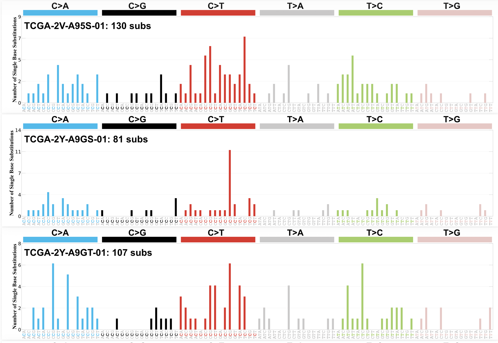

# 4. Visualizar el promedio de los perfiles mutacionales

Como vimos en el paso anterior, la visualización de las firmas mutacinales en cada muestra es algo muy complicado e inutil, es por eso que se crea un perfil mutacional promedio de todas las muestras, el cual utiliza porcentajes para no sesgar que unas muestras tienen más mutaciones que otras en general.

1. Primero seleccionamos los perfiles mutacionales del tipo SBS96 que queremos.

2. Luego conseguimos los porcentajes para todas las muestras

3. Sacamos los promedios y le ponemos el nombre de Average_LIHC a nuestro data frame

4. Arreglamos a la matriz para que en una columna esté el tipo de mutación y en la otra el promedio y la guardamos en una carpeta.

5. Hacemos el plot que se muestra abajo. En éste pódemos ver como hay una mayor proporción de sustituciones de C>T indicando que probablemente se tenga una firma mutacional al rededor de esta mutación. De C>A y T>C hay también indicios de posible firma mutacional, oero, sin tanto peso como de C>T.

```{r, eval = FALSE}
# -- Average mutational profiles --
av_mut_profiles = mutational_profiles[['96']]

# Relative mutational matrix
relative_mut_matrix = apply(av_mut_profiles, 2, prop.table)

# Average mutational matrix
av_mut_matrix = rowMeans(relative_mut_matrix)
av_mut_matrix = data.frame(Average_LIHC = av_mut_matrix)

# Add row names as column and print
av_mut_matrix_print = cbind(rownames(av_mut_matrix),
                            av_mut_matrix)
colnames(av_mut_matrix_print)[1] = 'MutationType'
write.table(av_mut_matrix_print, 'results/avg_LIHC.all',
            quote = F, row.names = F, sep = '\t')

# Plot average mutational profiles
plotSBS(matrix_path = 'results/avg_LIHC.all',
        output_path = 'graphs/',
        project = 'avg_LIHC',
        plot_type = '96',
        percentage = TRUE)

cat("\n****************\nAverage mutational matrix generated and plotted.\n****************\n")
```

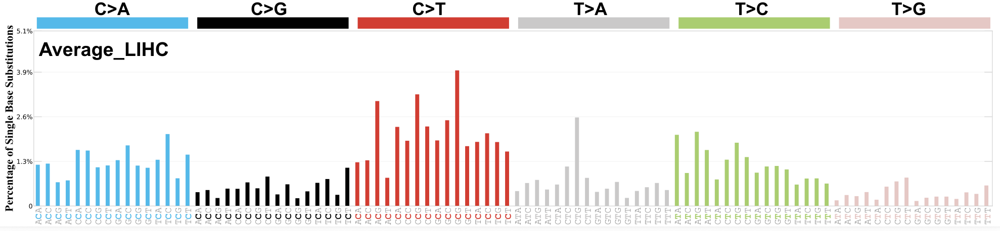

# 5. Visualizar el promedio de los perfiles mutacionales por subtipo

En el caso de nuestro cáncer y nuestro dataset no se reportan subgrupos de LIHC, literalmente solo hay N.A. o LIHC en la columna de subgrupos en los datos clínicos. Obtuve el plot y lo pongo aquí, pero, solo para que puedan ver que es idéntico y que por lo mismo no lo tomé en cuenta.

Lo único rescatable de aquí es que se creó la variable de metadata, que simplemente es el archivo de datos clínicos, pero, cargado en una variable en R y con las muestras que filtramos al inicio del trabajo.

```{r, eval = FALSE}
# -- Average mutational profiles per subgroup --

# Load metadata
metadata = read.delim('/mnt/data/bioinfo-estadistica-2/lgonzalez/datos_dani/cancer_genomics/data/LIHC/lihc_tcga_pan_can_atlas_2018_clinical_data_mtsign.tsv')

# Samples with mutation info
metadata = metadata %>%
  filter(Sample.ID %in% maf_SigProfiler$Tumor_Sample_Barcode)

save(metadata, file = "results/metadata.Rdata")
```

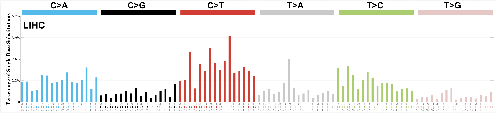

# 6. Extraer las mutational signatures

Realiza operaciones de descomposición de matrices para llegar a obtener firmas mutacionales *de novo*, las ucales mapeará hacia la base de datos de COSMIC buscando ver si alguna que encontró pertenece en realidad a una firma mutacional ya registrada. 

Si bien genera un resultado para cada npumero de frma mutacional posible (desde el minimo al máximo que indiquemos), el programa al final te va a sugerir una respuesta y dentro de esa carpeta van a tener otras 3 carpetas en las cuales se encontrará diversa información,

Este comando va a generar muchas gráficas:

- Perfil mutacional de las firmas generadas de novo (no muestro todos por obvias )

- Perfil mutacional de las firmas mutacionales mapeadas (no muestro todos por obvias razones)

- Un gráfico de barras con colores en el que sale qué tipo de firma mutacional estpa en qupe muestra (no muestro todos por obvias razones)

- Un gráfico de algún estadístico sibre las firmas mutacionales.

- Un gráfico de cómo se seleccionó el número de mutational signatures (estilo el codo de mario)

```{r, eval = FALSE}
# --- Extracting mutational signatures (SigProfiler Extractor) ---

sigprofilerextractor(input_type = 'matrix',
                     output = 'results/SPE/',
                     input_data = 'results/SPMG/output/SBS/LIHC.SBS96.exome',
                     nmf_replicates = 100,   # <- for stable results
                     minimum_signatures = 1,
                     maximum_signatures = 5, # <- Because we have > 200 samples
                     exome = T)

cat("\n****************\nExtracting of mutational signatures completed.\n****************\n")
```

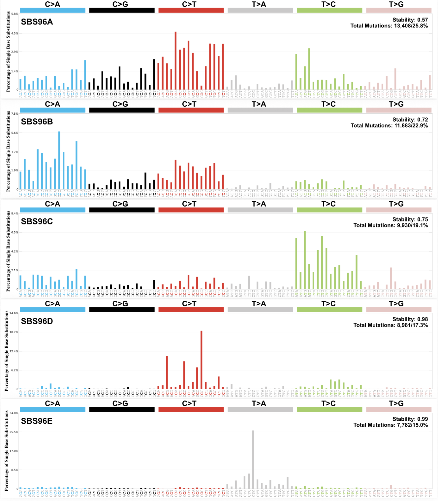

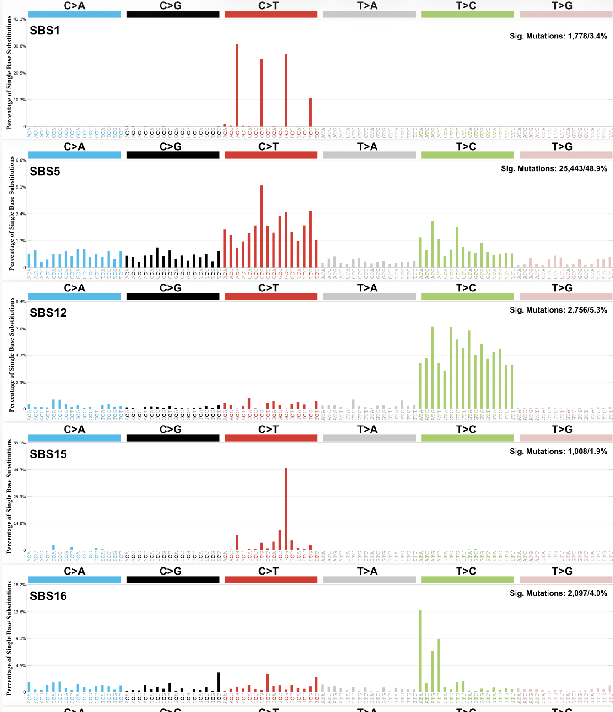

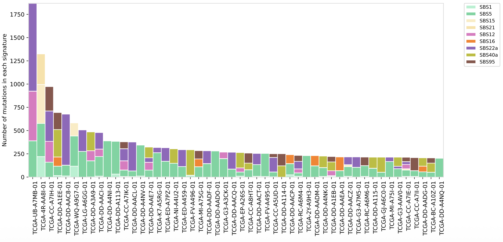

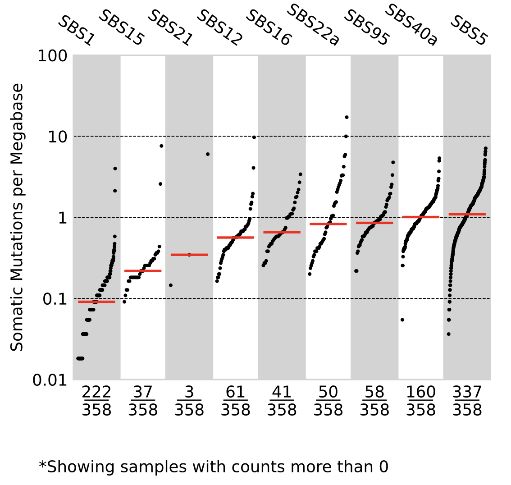

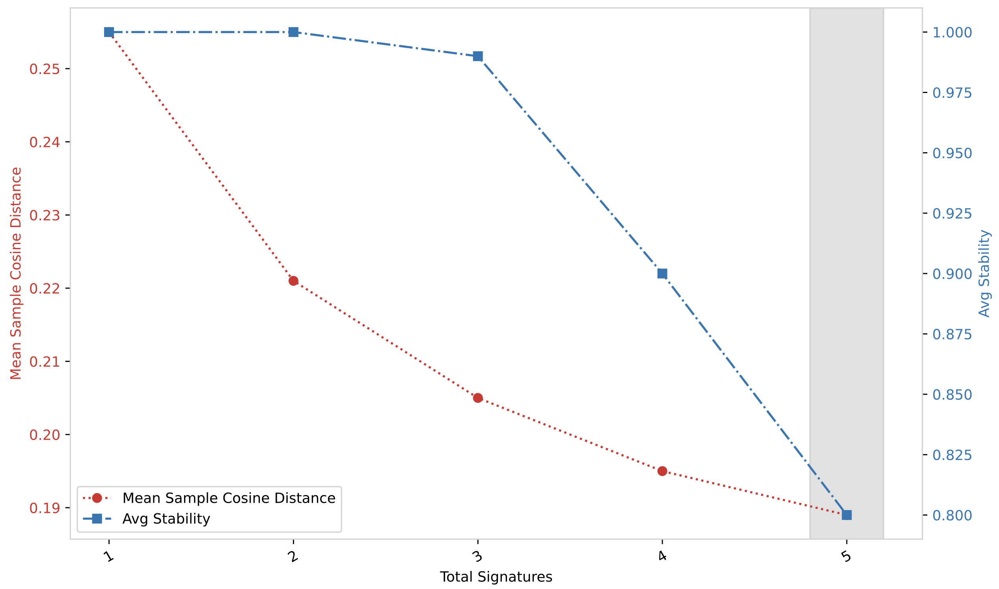

# 7. Añadiendo una referencia a las mutational signatures

Se quiere cuantificar el numero de mutaciones que contribuyeron cada firma mutacional a cada muestra. Saber qué proceso mutacional ocurre en cada tumor individual.

Se va a consultar a todas las mutational signatures que se tienen registradas en COSMIC y se va a ver cuál de ellas se le va a asignar a cada muestra. No se realizarán coasas de novo. Se obtienen dos gráficas muy similares a las anteriores. Además se obtiene un pdf con 4 gráficas por página, en este se muestra como es que se descomponen las firmas mutacionales de novo, es decir, si el programa encontró una firma nueva, busca en COSMIC a que combinación de las que ya están documentadas se parece más y las documenta, esta gráfica se llaman Decomposition Plots.

```{r, eval = FALSE}
# --- Assessing reference mutational signatures ---

# Assignment analysis
#cosmic_fit(samples = 'results/SPMG/output/SBS/LIHC.SBS96.exome',
#           output = 'results/SPA',
#           input_type='matrix',
#           exome = T)

cat("\n****************\nAssessing reference of mutational signatures completed.\n****************\n")
```

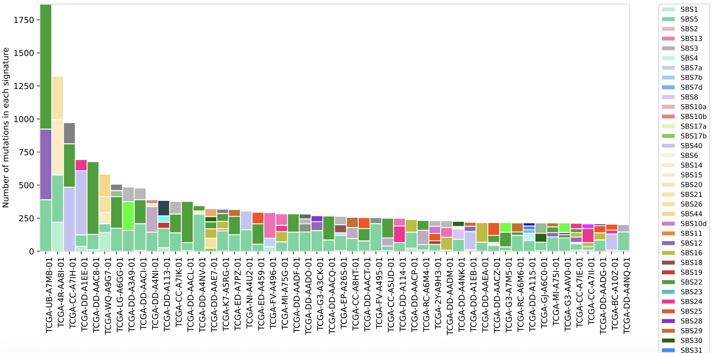

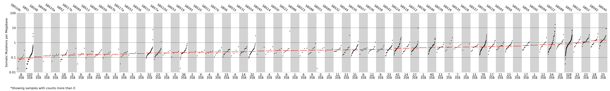

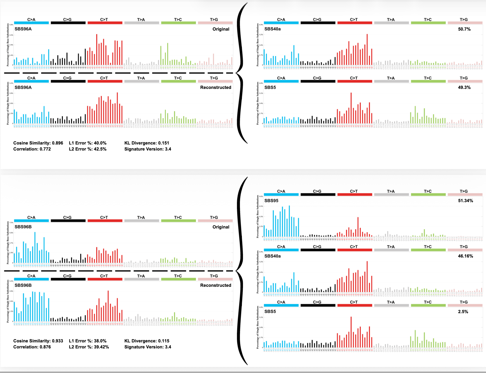

# 8. Accuary de las actividades de firmas

Para verificar qué tan bien es que se reconstruyó el perfil mutacional original de nuestro dataset tenemos que recurris a métricas como la del cosine similarity que se usa en este código, tendrá un score de 0 a 1, en el que 1 es el más alto y se ha medio definido un threshold de > 80 para decir que es una asignación de mutational signature correcta.

```{r, eval = FALSE}
# --- Downstream analysis of signature assignment results ---

# -- Assessing the accuracy of the signature activities --

stats <- read.delim('results/SPA/Assignment_Solution/Solution_Stats/Assignment_Solution_Samples_Stats.txt')

accuary_sig_act_plot <- ggplot(stats) +
  aes(x=Cosine.Similarity) +
  labs(x='')+
  geom_histogram(aes(y = after_stat(density))) +
  geom_density(col = 4, lwd = 1.5) +
  geom_vline(aes(xintercept = 0.8),
             col = 2, lwd = 1.5) +
  labs(x = 'Cosine Similarity') +
  theme_bw()

ggsave(filename = paste0(figdir, "Accuary_signature_activities_plot.png"), plot = accuary_sig_act_plot)

cat("\n****************\nAccuary of the signature activities plot completed.\n****************\n")
```

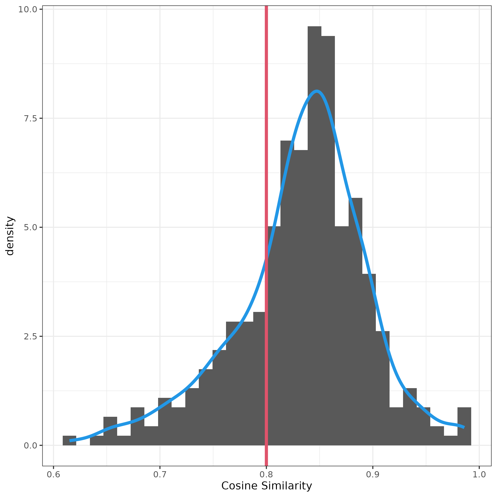

# 9. Visualizar la actividad de firmas de SigProfilerExtractor

Previamente obtuvimos una gráfica a la cual llamamos "Estadístico de mutational signatures", bueno, pues esta gráfica lo que verdaderamente te dice es cuantas muestras (eje X abajo) tienen la firma mutacional que se indica en la columna (eje X arriba) y el número de mutaciones somáticas por megabase normalizado con un logaritmo que le corresponde a cada muestra de cada firma mutacional (eje Y). Con este gráfico nos podemos hacer una idea de cual firma mutacional se encuentra en mayor proporción en las muestras de tumor y cuál es más frecuente encontrarla.


1. Cuando utilizamos SigProfilerExtractor se generó un archivo en el cuál se van a encontrar el número de mutaciones correspondientes a cada firma mutacional sugerida por el programa de cada muestra de tumor. Entonces cargamos este archivo y obtenemos el promedio de mutaciones por muestra de cada firma mutacional que se reporta en el archivo.

```{r, eval = FALSE}
# -- Visualizing signature activities from SigProfilerExtractor  --

# Activities matrix
act_matrix = read.delim('results/SPE/SBS96/Suggested_Solution/COSMIC_SBS96_Decomposed_Solution/Activities/COSMIC_SBS96_Activities.txt')

# Average activities per signature
avg_act_per_signature = colMeans(act_matrix[,-1])
cat("\n****************\nActivities per signature\n****************\n")
avg_act_per_signature
cat("\n****************\n")

```

2. Después generamos un barplot para poder visualizar de una manera más fácil cuál es la firma mutacional más común. En nuestro caso las 4 firmas mutacionales con mayor número de mutaciones en promedio son SBS5, SBS40a, SBS20a y SBS95, las 3 primeras corresponden a firmas mutacionales establecidas en COSMIC, mientras que la 4 corresponde a un artefacto de secuenciación según lo reportado en COSMIC, no se incluían firmas de novo en el archivo.

```{r, eval = FALSE}
# Save plot because the cluster can not renderize images
avg_act_barplot <- ggplot(data = data.frame(Signature = names(avg_act_per_signature),
                                            Avg = avg_act_per_signature)) +
  aes(x = reorder(Signature, Avg), y = Avg) +
  geom_bar(stat = 'identity', fill = 'steelblue') +
  coord_flip() +
  labs(x = 'Signature', y = 'Average mutations') +
  theme_bw()

ggsave(filename = paste0(figdir, "Average_activities_barplot.png"), plot = avg_act_barplot)

cat("\n****************\nAverage activities per signature barplot completed.\n****************\n")
```

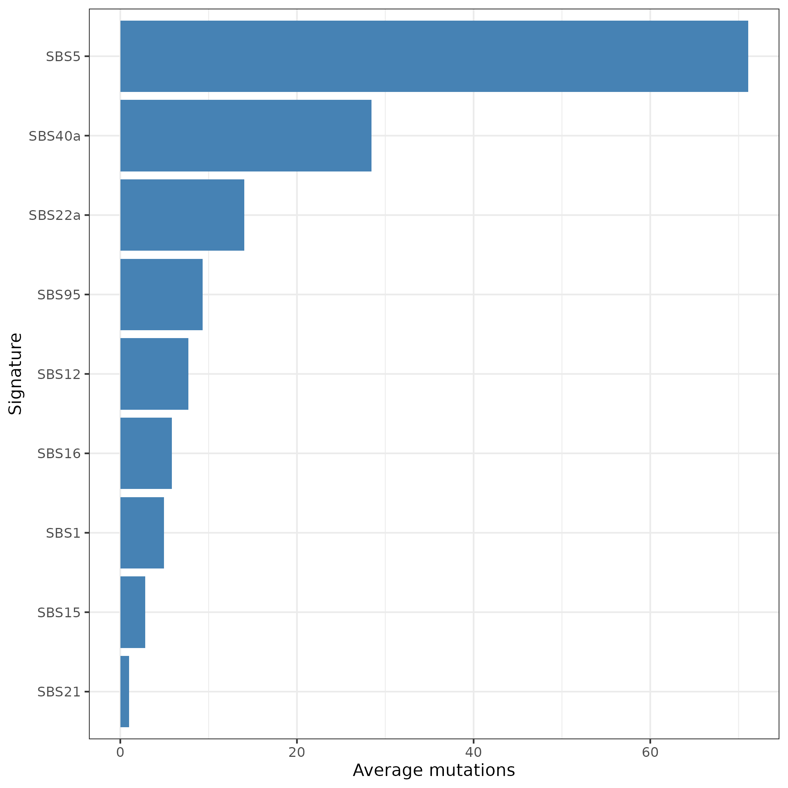

3. Luego obtenemos un barplot stackeado para todas las muestras, es decir, por cada muestra habrá una barra la cual se dividirá en un cierto número de colores los cuales representan cada uno a una firma mutacional, y así ver la proporción en la que se encuentran las firmas mutacionales a lo largo de nuestras muestras de una forma visual más clara. Sin embargo, dbeido a la cantidad de muestras en nuestro cohorte se ve amontonado y no se puede distinguir con claridad.

```{r, eval = FALSE}
# Reformat dataframe to use ggplot
acts_reformat = act_matrix %>%
  pivot_longer(cols = !Samples,
               names_to = 'Signature',
               values_to = 'Mutations')

# Generate percent stacked barplot
ggplot(acts_reformat) +
  aes(x = Samples, y = Mutations, fill = Signature) +
  geom_bar(position = 'fill', stat = 'identity') +
  theme_bw() +
  theme(axis.title.x=element_blank(),
        axis.text.x=element_blank(),
        axis.ticks.x=element_blank())

cat("\n****************\nAccuary of the signature activities percent stacked plot completed.\n****************\n")
```

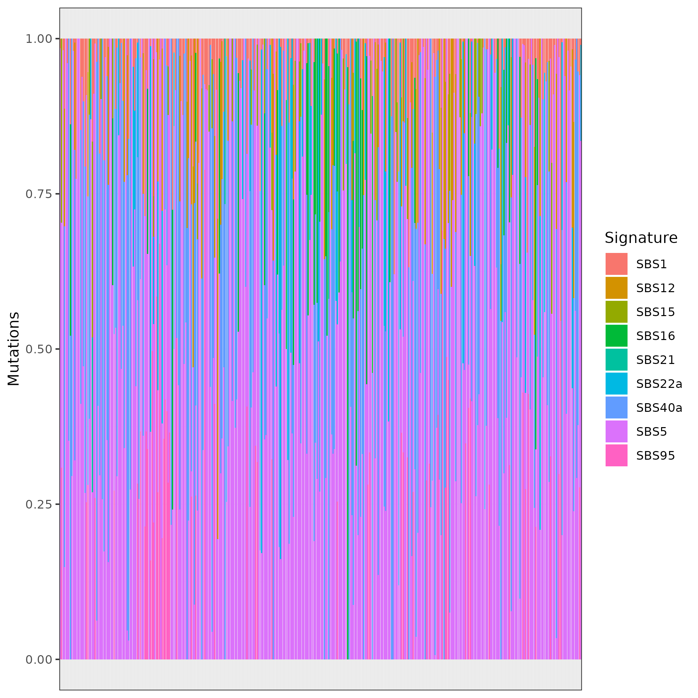

4. Para resolver este problema de visualización se obtienen las 10 muestras más mutadas y graficamos de la misma manera y con los mismos colores. 

```{r, eval = FALSE}
# Calculate number of mutations per sample
num_mutations_per_sample = rowSums(act_matrix[,-1])

# Selecting the activities of only the top 10 mutated cases
top_10_mutated_samples = act_matrix[order(num_mutations_per_sample,
                                          decreasing = T)[1:10],]

# Reformatting and plotting
top_10_mut_samples_plot <- top_10_mutated_samples %>%
  pivot_longer(cols = !Samples,
               names_to = 'Signature',
               values_to = 'Mutations') %>%
  ggplot() +
  aes(x = reorder(Samples, Mutations), y = Mutations, fill = Signature) +
  geom_bar(position = 'fill', stat = 'identity') +
  theme_bw() +
  labs(x = 'Samples')  +
  theme(axis.text.x = element_text(angle = 90, hjust = 1, vjust = 0.5))

ggsave(filename = paste0(figdir, "top_10_mut_samples.png"), plot = top_10_mut_samples_plot)

cat("\n****************\nAccuary of the signature activities percent stacked plot of teh top 10 mutated samples completed.\n****************\n")
```

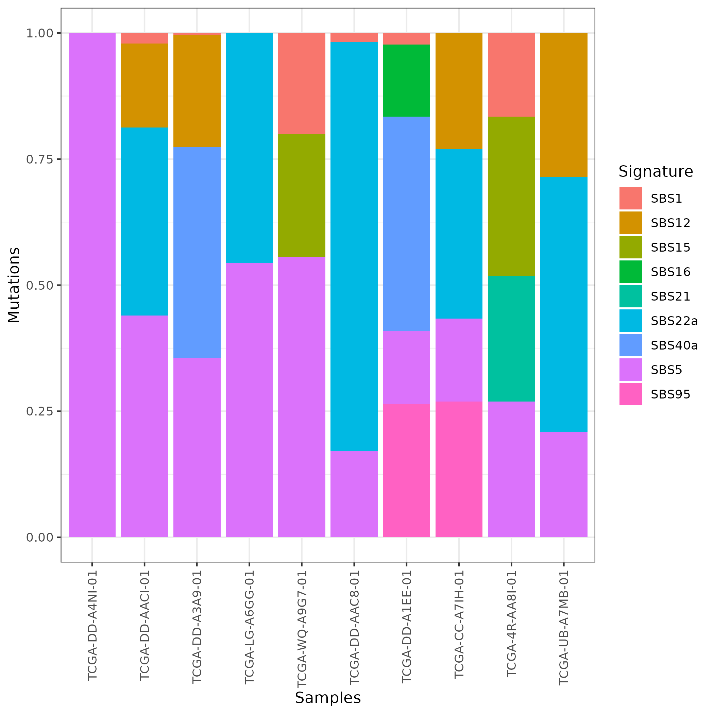

# 10. Asociar actividad de firmas (número de firmas) con metadata específica

El código siguiente es grande, no lo dividí por el motivo de que aquí se busca obtener los perfiles mutacionales promedio de los diferentes subtipos dentro de nuestro cohorte, sin embargo, como se mencionó anteriormente, nuestro dataset no contiene subtipos de LIHC, por lo que el análisis es exactamente igual, incluso si se graficara solo se mostraría una columna correspondiente a el úncios sobgrupo (LIHC). Para confirmar esto, les mostraré el output de una tabla en el que se ve la actividad de las firmas mutacionales por subgrupo en la cuál se puede ver que solo se reporta un único subgrupo (LIHC.

```
  Subtype Signature Avg_mutations
  <chr>   <chr>             <dbl>
1 LIHC    SBS1               5   
2 LIHC    SBS12              7.79
3 LIHC    SBS15              2.87
4 LIHC    SBS16              5.78
5 LIHC    SBS21              1.03
6 LIHC    SBS22a            14.3 
```

```{r, eval = FALSE}
# -- Associating signature activities with specific metadata --

# Merge activities and metadata tables (The samples column needs to be renamed in one of them)
acts_and_metadata = acts_reformat %>%
  rename(Sample.ID = Samples) %>%
  left_join(metadata)

# Calculate average activities per subtype
acts_per_subgroup = acts_and_metadata %>%
  group_by(Subtype, Signature) %>%
  summarise(Avg_mutations = mean(Mutations))

cat("\n****************\nAverage activities per subtypes\n****************\n")
head(acts_per_subgroup)
cat("\n****************\n")

# Selecting only LIHC subtypes
##### THERE ARE NO SUBTYPES IN THIS DATASET
acts_per_subgroup = acts_per_subgroup %>%
  filter(grepl('LIHC', Subtype))

# Plotting stacked barplot per subtype
stacked_per_subtype_barplot <- ggplot(acts_per_subgroup) +
  aes(x = reorder(Subtype, Avg_mutations), y = Avg_mutations, fill = Signature) +
  geom_bar(position = 'fill', stat = 'identity') +
  theme_bw() +
  labs(x = 'Liver Hepatocarcinoma Subtype',
       y = 'Average number of mutations')

ggsave(filename = paste0(figdir, "stacked_per_subtype_plot.png"), plot = stacked_per_subtype_barplot)

```


# 11. Asociar actividad de firmas mutacionales con metadata en específic (driver genes)

Ahora utilizamos la información de nuestro archivo MAF original, para ver las muestras que tienen mutaciones en los genes drivers que encontramos en la sección anterior.

1. Seleccionamos las muestras que corresponden a cada gen driver y filtramos que solo se seleccionen aquellas que tienene variantes en una posición donde se ha reportado en COSMIS muchas variantes realcionadas a cáncer o en un dominio de la proteína que codifica o la combianción de ambos.

2. De nuestro archivo que viene cuantas mutaciones que corresponden a cada firma mutacional lo cargamos y creamos una tabla la cual contendrá a las muestras que seleccionamos en el paso anterior y el número de mutaciones de las 3 firmas mutacionales con mayor actividad. Imprimimos la tabla

3. Generamos un barplot para cada gen driver en la que aparecerán cada muestra que tiene mutaciones en ese gen y el mutational burde, ósea el número de mutaciones totales, no solamente las que corresponden a una mutational signature.

Al comparar con las tablas podemos darnos cuenta que las muestras con un mayor mutational burden le corresponden a aquella las cuales tienen una ayor actividad de firmas mutacionales.

## CTNNB1

```
           Samples SBS5 SBS40a SBS22a
1  TCGA-2Y-A9H1-01   50     78      0
2  TCGA-2Y-A9HA-01    0     86      0
3  TCGA-2Y-A9HB-01   38     48      0
4  TCGA-3K-AAZ8-01  154      0     23
5  TCGA-4R-AA8I-01  357      0      0
6  TCGA-5C-A9VG-01  174      0      0
7  TCGA-5R-AA1C-01   47     68      0
8  TCGA-BW-A5NQ-01   32     85      0
9  TCGA-CC-A5UD-01   52      0    156
10 TCGA-CC-A7IH-01  160      0    327
11 TCGA-CC-A7IK-01   70      0    130
12 TCGA-CC-A7IL-01   87      0      0
13 TCGA-CC-A9FW-01   89     64     21
14 TCGA-DD-A116-01   35     72      0
15 TCGA-DD-A1EE-01  101    295      0
16 TCGA-DD-A1EL-01   17      0      0
17 TCGA-DD-A39V-01   79      0      0
18 TCGA-DD-A3A3-01   34     32      0
19 TCGA-DD-A4NF-01  155      0      0
20 TCGA-DD-A4NI-01  390      0      0
21 TCGA-DD-A4NK-01   95    125      0
22 TCGA-DD-A73D-01   77      0      0
23 TCGA-DD-A73E-01  118      0      0
24 TCGA-DD-AAC8-01  116      0    549
25 TCGA-DD-AACA-01   50     35      0
26 TCGA-DD-AACB-01   43     76      0
27 TCGA-DD-AACD-01  110      0      0
28 TCGA-DD-AACJ-01   75      0      0
29 TCGA-DD-AACP-01  121      0      0
30 TCGA-DD-AACX-01  145      0      0
31 TCGA-DD-AAD0-01   47     71      0
32 TCGA-DD-AADD-01   37     39      0
33 TCGA-DD-AADE-01   41     40      0
34 TCGA-DD-AADG-01   56     90      0
35 TCGA-DD-AADU-01   36      0     27
36 TCGA-DD-AAE3-01    0      0      0
37 TCGA-DD-AAE9-01  115      0     26
38 TCGA-DD-AAEB-01   31     56      0
39 TCGA-DD-AAEE-01   25     40      0
40 TCGA-DD-AAEH-01    0     83      0
41 TCGA-DD-AAEK-01   47      0      0
42 TCGA-DD-AAVP-01   74      0      0
43 TCGA-DD-AAVQ-01   46      0      0
44 TCGA-DD-AAVX-01   14     71      0
45 TCGA-DD-AAVY-01  115      0      0
46 TCGA-DD-AAW1-01   33     39     58
47 TCGA-DD-AAW2-01   38     46     41
48 TCGA-DD-AAW3-01  125      0      0
49 TCGA-ED-A7PZ-01  168      0    146
50 TCGA-ED-A7XP-01   14     26      0
51 TCGA-EP-A12J-01   61      0      0
52 TCGA-EP-A26S-01   44    165      0
53 TCGA-EP-A2KC-01    4     73      0
54 TCGA-EP-A3RK-01  147      0      0
55 TCGA-FV-A4ZQ-01   21     40      0
56 TCGA-G3-A3CK-01  199      0      0
57 TCGA-G3-A5SL-01  158      0      0
58 TCGA-G3-A6UC-01   38     75      0
59 TCGA-G3-AAV1-01   72      0      0
60 TCGA-G3-AAV2-01   45      0     14
61 TCGA-G3-AAV3-01   26     61      0
62 TCGA-G3-AAV4-01   57     93      0
63 TCGA-G3-AAV5-01   41     46      0
64 TCGA-G3-AAV6-01   85      0      0
65 TCGA-KR-A7K0-01   77     41      0
66 TCGA-LG-A9QD-01   80     61      0
67 TCGA-MI-A75H-01   13    112      0
68 TCGA-NI-A8LF-01  132      0      0
69 TCGA-O8-A75V-01   10     55      0
70 TCGA-RC-A6M4-01   36      0     81
71 TCGA-RG-A7D4-01   60     34      0
72 TCGA-UB-A7MC-01   84      0      0
73 TCGA-UB-A7MD-01   65     64      0
74 TCGA-WX-AA47-01   51      0      0
75 TCGA-XR-A8TF-01   35     86     53
76 TCGA-ZP-A9CV-01   53     50      0
77 TCGA-ZP-A9D4-01   50     36      0
78 TCGA-ZS-A9CG-01   81      0     15
```

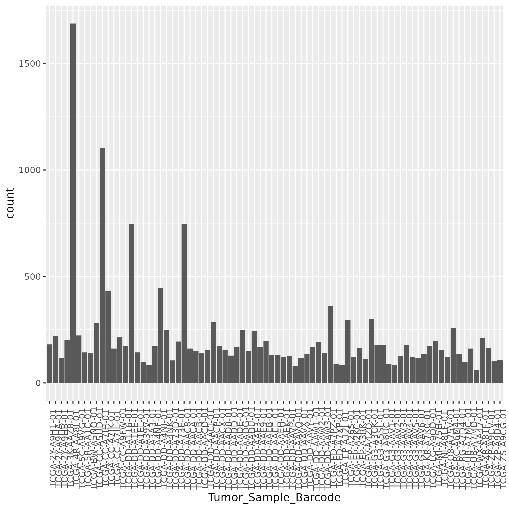


## NFE2L2

```
          Samples SBS5 SBS40a SBS22a
1 TCGA-5R-AAAM-01  102      0      0
2 TCGA-DD-A39V-01   79      0      0
3 TCGA-DD-A4NO-01  127      0      0
4 TCGA-DD-AAC8-01  116      0    549
5 TCGA-DD-AADJ-01   72      0      0
6 TCGA-DD-AAVY-01  115      0      0
7 TCGA-G3-AAV3-01   26     61      0
```

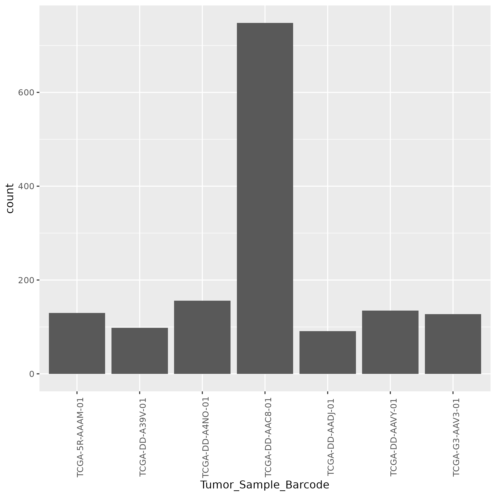

## CRIP3

```
          Samples SBS5 SBS40a SBS22a
1 TCGA-DD-A1EB-01    9     95      0
2 TCGA-DD-A1EE-01  101    295      0
3 TCGA-DD-AAEH-01    0     83      0
4 TCGA-DD-AAVP-01   74      0      0
5 TCGA-G3-A25S-01   51     88      0
```

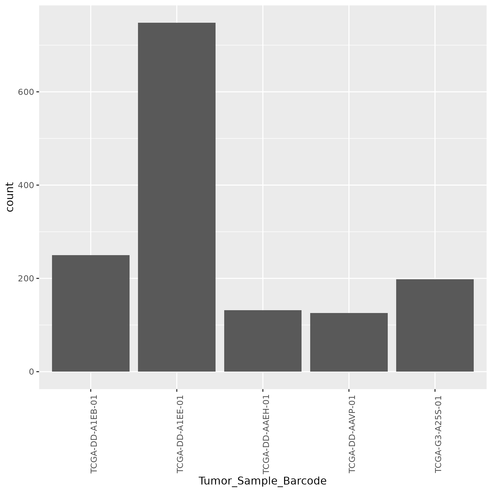

